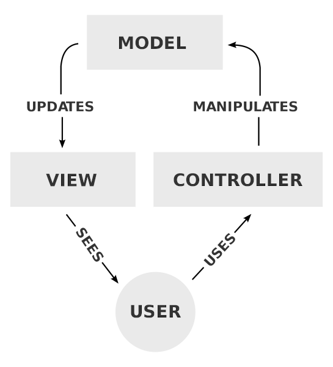

# **Rails trainings**

Introduction & fundamentals

---

## Where to get informations

- [Rails guide](https://guides.rubyonrails.org/)
- [Gist with common commands](https://github.com/girardof/rails_trainings/blob/main/rails_gist.md)

---

## Rails philosophy 

- [Don't Repeat Yourself](https://en.wikipedia.org/wiki/Don%27t_repeat_yourself)
- [Convention Over Configuration](https://en.wikipedia.org/wiki/Convention_over_configuration)
- [MVC pattern](https://en.wikipedia.org/wiki/Model%E2%80%93view%E2%80%93controller)

---

## MVC pattern


<!-- divides the responsibilities of an application to make it easier to understand -->

---

## Views 
- Present data to user
- Allow user to interact with the data

**Tools and library**
- Haml
- Angular 1
- helpers
<!-- helpers are available in all views 
     example : `network_episode_permalink_url` in `app/helpers/blog_helper.rb` -->
- Coffee script
- Cells
<!-- specify they should not create new cells -->

---

## Views - [Angular 1](https://devdocs.io/angularjs~1.5/) 

- difference `ngShow`/`ngHide` and `ngIf`
<!-- ngIf include or not the section in the DOM while ngShow and ngHide uses css to display or hide -->
  
---

### Views - [Haml](https://haml.info/)

<!-- indentation matters
     quick word on the syntax -->
**Syntax** 

```haml
%section.container
  %h1= post.title
  %strong.code#message Hello, World!
```

**Partials**

```haml
= render 'sidebar'
```

**Ruby variables**

```haml
.content
  = @podcast.name
```

---

# Models

- Represent the data
- Interact with the database (postgreSQL)
- Check for validity of data 
---

# Controllers 

- Find the correct view 
- Check permissions
- Instance variables
- Concerns 

---

# [Active record](https://guides.rubyonrails.org/active_record_basics.html) - database manager

- Schema configured in `db/schema.rb`
<!-- contain the current schema of the database
     automatically updated with migrations -->
- Uses migrations files stored in `db/migrate`
<!-- fire a rails console and show how to quickly CRUD in the db
     run a migration file -->

--- 

# Environments

`RAILS_ENV=`
- production
- development
- test
<!-- in console `RAILS_ENV=test bundle exec rails c` uses a different database than development
     development is the default 
     same for running migrations -->

---

# [Routing](https://guides.rubyonrails.org/routing.html)

Configured in `config/routes.rb`

```ruby
resources :networks, only: %i[index show create destroy]
```
<!-- show `~/work/podigee/app/controllers/networks_controller.rb` -->

---

# Rake tasks

- Small script to perform specific action
- Stored in `lib/tasks`
- Used to run migrations
- `one_off` folder
<!-- show that rails migrate command uses rake underneath -->

---

# Image server

--- 

# API 

- [public API](https://app.podigee.com/api-docs) 
- private API stored in `app/controllers/api/` 
<!-- ideally they should not create anything in the private as we want to get ride of it -->
- how to find endpoints

--- 

# services fodler

- creator and updator files (if enough time)
